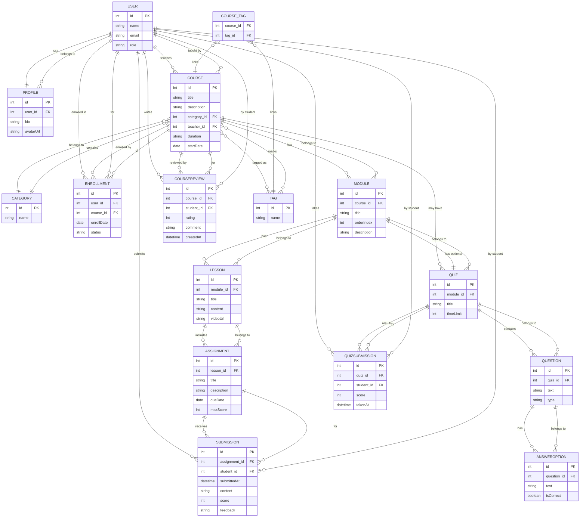

# Учебная платформа для онлайн курса - задание

## Введение

Проект представляет собой учебную платформу для онлайн-курса по ORM и Hibernate.

Проект имитирует реальный заказ: образовательная компания нуждается в системе управления учебными курсами, которая позволит вести расписание занятий, раздавать задания студентам, собирать их решения и проводить тестирование знаний.

Проект будет полезен для закрепления навыков работы с JPA/Hibernate, Spring Boot и реляционными БД, а также для понимания проблем, с которыми можно столкнуться при работе с ORM (например, с проблемой ленивой загрузки).

Выполнение проекта подразумевает получение практического опыта создания сложной серверной системы.

## Что нужно сделать

Необходимо разработать веб-приложение (учебную платформу) на базе Spring Boot, которое использует Hibernate/JPA для доступа к базе данных PostgreSQL.

Приложение должно обеспечивать хранение структуры курсов и учебных материалов, управление пользователями (студентами и преподавателями), а также процессы обучения - запись на курс, выполнение домашних заданий, прохождение тестов.

В результате должна быть разработана гибкая модель данных с множеством связей, что позволит столкнуться с практическими аспектами работы с ORM, а также научит создавать репозитории и CRUD-операции и писать интеграционные тесты для проверки работы приложения.

### Технические требования

- **Стек технологий**:
  - Java 21.
  - Spring Boot 3.5.7.
    - Spring Web (для создания эндпоинтов).
    - Spring Data JPA (для использования Hibernate).
    - PostgreSQL Driver (для взаимодействия с PostgreSQL).
    - Testcontainers (для тестирования взаимодействия с БД).
  - СУБД PostreSQL.
  - Maven.
- **Модель данных**: спроектировать от 15 до 20 сущностей (классов JPA), отражающих предметную область учебной платформы. Включить типичные связи: «один к одному», «один ко многим», «многие ко многим».
- **Связи и загрузка**: настроить ORM-связи таким образом, чтобы по умолчанию использовалась ленивая загрузка (Lazy) для связанных коллекций. База данных должна быть устроена так, чтобы при работе с ней студенты столкнулись с проблемами ленивой загрузки (например, LazyInitializationException при попытке обратиться к несессионным зависимостям вне транзакции). Это поможет отработать понимание механизма Lazy Loading и способов его обхода.
- **Spring Data JPA репозитории**: для ключевых сущностей реализовать интерфейсы репозиториев (на основе JpaRepository или аналогичных) с базовыми методами CRUD. Должны быть обеспечены операции создания, чтения, обновления, удаления для основных объектов системы.
- **CRUD-функциональность**: приложение должно поддерживать создание и управление всеми основными сущностями учебной платформы через код (например, посредством сервисного слоя или REST API - см. доп. задания). Необходимо предусмотреть бизнес-логику для основных сценариев: добавление нового курса, запись студента на курс, создание материалов урока, сдача домашнего задания, прохождение теста и так далее.
- **PostgreSQL и конфигурация**: хранение данных реализовать в СУБД PostgreSQL. Параметры подключения (URL, логин, пароль БД и другие) вынести в файл конфигурации (например, application.properties/application.yml), без хардкода в коде. При запуске приложения схема базы данных должна автоматически создаваться/обновляться на основе моделей (при необходимости использовать spring.jpa.hibernate.ddl-auto).
- **Интеграционные тесты**: добавить интеграционные тесты, которые проверяют создание схемы БД, наполнение её тестовыми данными и выполнение CRUD-операций. Тесты должны запускать контекст Spring (например, с использованием @SpringBootTest) и проверять корректность работы репозиториев и основной логики (например, сохранение и получение сущностей, каскадное сохранение связанных объектов, удаление с зависимостями и тому подобное).
- **Дополнительные требования**: реализовать REST API и простой пользовательский интерфейс для работы с системой - см. раздел «Дополнительные задания». Это не обязательно для сдачи проекта, но продемонстрирует умение строить полноценное веб-приложение поверх созданной базы.

### Структура базы данных: сущности и связи

Ниже приведена примерная структура основных сущностей учебной платформы и их взаимоотношений. Ваше решение может немного отличаться (именами или дополнительными атрибутами или содержать дополнительные сущности), но в целом должно быть близко к данной модели.

#### User (Пользователь)

Представляет участника системы - студент, преподаватель или администратор.

- **Приблизительные поля**: id (PK), name, email (уникальный), role (ENUM или строка: STUDENT/TEACHER/ADMIN), другие контакты.
- **Приблизительные связи**:
  - Один пользователь может быть преподавателем во многих курсах - связь «один ко многим»: User (преподаватель) -> Course (coursesTaught); в классе Course будет поле teacher с @ManyToOne на User.
  - Один пользователь-студент может быть записан на многие курсы - связь реализована через Enrollment (см. ниже) как «многие ко многим».
  - Один пользователь может иметь один профиль (детали) - связь «один к одному» с сущностью Profile.
  - Пользователь может иметь много отправленных решений заданий - связь «один ко многим»: User -> Submission (одно решение относится к одному студенту).
  - Пользователь может иметь много результатов тестов - связь User -> QuizSubmission.
  - Пользователь-студент может оставить много отзывов на курсы - связь User -> CourseReview.

#### Profile (Профиль пользователя)

Дополнительная информация о пользователе (например, биография, аватар, контакты).

- **Приблизительные поля**: id (PK), user_id (FK на User), bio, avatarUrl, и тому подобные.
- **Приблизительные связи**: «один к одному»: каждый Profile привязан к ровно одному User (обычно Profile хранит редко используемые поля, чтобы не загружать их каждый раз с User). В User можно использовать @OneToOne(mappedBy="user", fetch = FetchType.LAZY) для ленивого профиля.

#### Course (Курс)

Учебный курс.

- **Приблизительные поля**: id (PK), title, description, category_id (FK на Category), teacher_id (FK на User преподавателя), и др. например, duration, startDate.
- **Приблизительные связи**:
  - Категория: «многие к одному» - у многих курсов может быть одна категория. Поле category в Course с аннотацией @ManyToOne.
  - Преподаватель: «многие к одному» - поле teacher (@ManyToOne на User). Один преподаватель ведёт несколько курсов.
  - Модули: «один ко многим» - коллекция modules (тип `List<Module>`) в Course, аннотация @OneToMany(mappedBy="course", fetch=LAZY, cascade=...). Один курс включает несколько модулей.
  - Записи студентов: «многие ко многим» через Enrollment - можно иметь коллекцию enrollments (`List<Enrollment>`) в Course, где Enrollment содержит ссылку на курс и на пользователя. Либо коллекцию students с @ManyToMany, но тогда нужна mappedBy на соответствующее поле в User. Предпочтительно использовать Enrollment.
  - Отзывы: «один ко многим» - коллекция reviews (`List<CourseReview>`) с @OneToMany(mappedBy="course"). Один курс может иметь много отзывов от студентов.
  - Викторины: если решили, что тесты привязаны к курсу (например, финальный экзамен), то связь «один ко многим»: Course -> Quiz. Если тесты на модуль - тогда Course не напрямую связан с Quiz. В диаграмме QUIZ связан внешним ключом MODULE.

#### Category (Категория курса)

Классификация курсов (например, «Программирование», «Дизайн», «Маркетинг»).

- **Приблизительные поля**: id (PK), name (например, "Programming").
- **Приблизительные связи**: «один ко многим»: одна категория содержит много Course. В Course хранится внешний ключ на Category.

#### Enrollment

Сущность-связка между студентом и курсом, отражающая факт, что данный User записан на данный Course.

- **Приблизительные поля**: id (PK) или можно сделать составной PK (user_id + course_id), user_id (FK), course_id (FK), например enrollDate, status (Active/Completed).
- **Приблизительные связи**: «многие к одному»: Enrollment -> User (много записей к одному пользователю) и Enrollment -> Course (много записей к одному курсу). Со стороны User можно иметь `List<Enrollment> enrollments` (все записи данного студента), со стороны Course - аналогично. Таким образом, User и Course связаны через этот промежуточный класс.
- **Примечание**: если не использовать отдельную сущность, а делать ManyToMany, то связей Enrollment не будет, связь описывается аннотацией в User и Course с @JoinTable. Но отдельная сущность предпочтительнее для хранения статуса, даты и пр.

#### Module (Модуль)

Тематический раздел внутри курса.

- **Приблизительные поля**: id (PK), course_id (FK), title, orderIndex (порядковый номер в курсе), возможно description.
- **Приблизительные связи**:
  - «Многие к одному»: Module -> Course (поле course).
  - «Один ко многим»: Lessons - в Module коллекция lessons (`List<Lesson>`, @OneToMany(mappedBy="module", fetch=LAZY)). Один модуль содержит несколько уроков.
  - «Один к одному» (опционально): Quiz - если в конце модуля есть тест. Можно добавить поле quiz с @OneToOne(mappedBy="module") в Module, и в Quiz соответственно @OneToOne @JoinColumn("module_id"). Тогда у каждого модуля не более одного теста.

#### Lesson (Урок)

- **Приблизительные поля**: id (PK), module_id (FK), title, content (например, текст урока или ссылка на материалы), videoUrl и т.п.
- **Приблизительные связи**:
  - «Многие к одному»: Lesson -> Module (поле module).
  - Assignments: «один ко многим» - коллекция assignments (@OneToMany(mappedBy="lesson")): урок может иметь несколько заданий. (Либо можно упростить и ограничиться одним заданием на урок, тогда можно сделать поле assignment с OneToOne, но обычно заданий может быть несколько, поэтому выберем List.)

#### Assignment (Задание)

- **Приблизительные поля**: id (PK), lesson_id (FK) или module_id (если задания привязываются к модулю в целом), title (краткое название задания), description (текст задания, требования), dueDate (дедлайн), maxScore (максимальный балл, например 100).
- **Приблизительные связи**:
  - «Многие к одному»: Assignment -> Lesson (привязано к уроку). Если задания к модулю, то соответственно module_id.
  - Submissions: «один ко многим» - коллекция submissions (@OneToMany(mappedBy="assignment")). На одно задание может быть много решений от разных студентов.

#### Submission (Решение, отправленная работа)

Ответ/решение студента на задание.

- **Приблизительные поля**: id (PK), assignment_id (FK), student_id (FK на User), submittedAt (datetime отправки), content (текст ответа или путь к файлу), score (оценка, nullable до проверки), feedback (текст комментария преподавателя).
- **Приблизительные связи**:
  - Submission -> Assignment (одно задание, много решений).
  - «Многие к одному»: Submission -> User (один студент может иметь много Submission, но каждое Submission - одному студенту).
  - В классе User можно иметь коллекцию submissions, если нужно.
  - В Assignment - коллекция submissions.
- **Дополнительно**: можно усилить уникальность (user_id + assignment_id) на уровне БД или приложения, чтобы один студент не подал два решения на одно задание.

#### Quiz (Тест)

Набор вопросов для проверки знаний по модулю или курсу.

- **Приблизительные поля**: id (PK), module_id (FK) - если тест на модуль, либо course_id - если тест на курс, title (например «Тест по модулю 1»), возможно timeLimit.
- **Приблизительные связи**:
  - «Один к одному»: Quiz -> Module (если один модуль - один тест). Либо «многие к одному: много Quiz на один курс.
  - «Один ко многим»: Questions - коллекция questions (@OneToMany(mappedBy="quiz")).

#### Question (Вопрос)

Вопрос викторины/теста.

- **Приблизительные поля**: id (PK), quiz_id (FK), text (текст вопроса), type (например, SINGLE_CHOICE/MULTIPLE_CHOICE).
- **Приблизительные связи**:
  - «Многие к одному»: Question -> Quiz.
  - «Один ко многим»: AnswerOption - коллекция options (@OneToMany(mappedBy="question")). Один вопрос имеет несколько вариантов ответа.

#### AnswerOption (Вариант ответа)

Вариант ответа на определённый вопрос.

- **Приблизительные поля**: id (PK), question_id (FK), text (текст ответа), isCorrect (boolean, пометка, правильный ли это вариант).
- **Приблизительные связи**: «многие к одному»: AnswerOption -> Question.

#### QuizSubmission (Результат теста)

- **Приблизительные поля**:  id (PK), quiz_id (FK), student_id (FK на User), score (набранный балл или % правильных ответов), takenAt (дата прохождения).
- **Приблизительные связи**:
  - «Многие к одному»: QuizSubmission -> Quiz.
  - «Многие кк одному»: QuizSubmission -> User (студент).
  - Опционально, связь «один ко многим»: Quiz -> quizSubmissions (все результаты по этому тесту), User -> quizSubmissions (все результаты данного студента).
- **Примечание**: в более сложной модели можно добавить связь с AnswerOption, чтобы хранить выбранные ответы, но для оценки знаний достаточно сохранять итог.

#### CourseReview (Отзыв о курсе)

- **Приблизительные поля**: id (PK), course_id (FK), student_id (FK), rating (числовая оценка, например 1-5), comment (текст отзыва), createdAt.
- **Приблизительные связи**:
  - «Многие к одному»: CourseReview -> Course.
  - «Многие к одному»: CourseReview -> User (студент).
  - «Один ко многим»: Course -> reviews (список отзывов), User -> reviews (отзывы, оставленные пользователем).

#### Tag (Тег)

Метка для курса (например, ключевые слова: "Java", "Hibernate", "Beginner").

- **Приблизительные поля**: id (PK), name (например "Java").
- **Приблизительные связи**: «многие ко многим» с Course. Реализуется через вспомогательную таблицу course_tag (course_id, tag_id). В классе Course можно иметь `Set<Tag>` tags (@ManyToMany) с @JoinTable(name="course_tag", ...). В классе Tag - соответственно `Set<Course>` courses с mappedBy. Это дополнительная возможность для фильтрации курсов, не обязательная, но демонстрирует ManyToMany без промежуточной сущности.

### Структура базы данных: визуализация

Структура выше покрывает основные сущности. В проекте могут появиться и другие (например, «Администратор» как отдельный класс пользователя, «Уведомление» и так далее), но нужно следить, чтобы общее число не вышло за разумные пределы и все связи были обоснованными.

Вот приблизительная визуализация нашей учебной базы данных, созданная в инструменте Mermaid Live Editor

### Примечание по ленивой загрузке

Необходимо обратить внимание, что связи типа OneToMany и ManyToMany по умолчанию LAZY - то есть коллекции модулей в курсе, уроков в модуле, заданий в уроке, решений в задании, вопросов в квизе и так далее будут загружаться только при явном обращении. Это именно то, что нужно, чтобы в процессе работы обнаружить потенциальные места, где требуется либо включить fetch, либо реорганизовать логику доступа к данным. Связи ManyToOne и OneToOne по умолчанию EAGER (Hibernate специфика) - например, при загрузке Submission сразу загрузится объект User студента (если не указать LAZY вручную). В таких случаях можно явно поставить fetch = LAZY на @ManyToOne/@OneToOne, если хотим отложить загрузку (Hibernate это позволяет, хотя JPA стандарт для OneToOne EAGER). В проектах обычно стараются избегать лишнего EAGER, поэтому можно настроить все связи на LAZY, где это оправдано.

## Этапы выполнения проекта

Разработка будет проходить в несколько этапов. На каждом этапе необходимо выполнить определённую часть работы:

### Этап 1. Анализ требований и планирование

**Задачи этапа**: внимательно изучить техническое задание и продумать архитектуру решения:

- **Выделение функциональности**. Определите основные функции системы, которые предстоит реализовать. Необходимо понять, как будут работать ключевые части учебной платформы, прежде чем писать код. К таким функциям относятся, например: управление списком курсов и модулей, регистрация студентов на курс, ведение уроков и заданий, проведение тестирования, хранение результатов и так далее.
- **Проектирование модели данных**. На основе выбранных функций спланируйте структуру базы данных. Выделите все сущности, которые потребуются системе (ориентируясь на диапазон 15–20 штук), и определите связи между ними. Рекомендуется набросать диаграмму или таблицу сущностей: у каждой прописать ключевые поля и связи (например, «Курс» связана «один ко многим» с «Модулями», «Студент» связан отношением «многие ко многим» с «Курсами» через сущность «ЗаписьНаКурс» и так далее). Убедитесь, что вы учитываете различные типы отношений (1-1, 1-M, M-M) и продумываете, где нужна ленивость загрузки.
- **Планирование реализации**. Составьте план, в каком порядке будете реализовывать функциональные части. Например, сперва модели и репозитории, затем бизнес-логику для создания курсов, затем функциональность записи на курс и так далее. Учтите, какие компоненты зависят друг от друга. Также спланируйте написание тестов: какие сценарии важно проверить.

**Основные задачи, которые следует учесть при планировании**:

- Управление **курсами и контентом** (создание курсов, модулей, уроков, привязка преподавателя к курсу, категоризация курсов).
- **Регистрация студентов** на курсы и роли пользователей (студенты vs преподаватели, возможно администраторы).
- Работа с **учебными заданиями**: создание заданий к урокам, загрузка решений студентами, оценивание.
- Проведение **тестирования (quiz)**: создание тестов с вопросами и вариантами ответов, прохождение тестов студентами, сохранение результатов.
- **Обработка ленивой загрузки**: определить, в каких случаях доступ к связанным данным требует особого внимания (например, получение списка уроков курса вне сессии) и как вы будете решать эти ситуации (через настройку fetch = LAZY/EAGER, использование JOIN FETCH в запросах, или транзакционных методов сервиса).

Перед переходом к кодированию убедитесь, что структура данных логически согласована и покрывает все перечисленные функции.

### Этап 2. Реализация основных функций

На этом этапе необходимо написать код, реализующий ядро системы - модели, репозитории и основные операции. Рекомендуется придерживаться многослойной архитектуры (например, слой данных, сервисный слой с бизнес-логикой, слой API/представления).

1. **Реализация модели данных.** Создайте классы-сущности JPA для всех спроектированных объектов. Каждую сущность снабдите аннотациями Hibernate/JPA (@Entity, @Table, @OneToMany, @ManyToOne, @ManyToMany, @OneToOne и так далее) в соответствии с разработанной схемой. Убедитесь, что:

- У каждой сущности есть первичный ключ (@Id, желательно с генерацией значения, например @GeneratedValue).
- Связи заданы правильно: например, класс «Курс» содержит коллекцию модулей `List<Module>` с аннотацией @OneToMany, а каждый «Модуль» имеет поле course с @ManyToOne. Для «многих ко многим» отношений используйте @ManyToMany (с промежуточной таблицей через @JoinTable или явной сущностью-связкой, например, для записи на курс).
- Для коллекций связанных объектов явно указана ленивая загрузка: fetch = FetchType.LAZY (по умолчанию для @OneToMany и @ManyToMany связи и так LAZY, но можно указать явно для ясности). Это нужно, чтобы при выборке, например, курса из базы сразу не подтягивались все связанные данные, что соответствует реальному поведению ORM и позволит отловить проблемы при доступе к ним вне транзакции.
- Настроены каскадные операции там, где это имеет смысл. Например, удаление курса может каскадно удалять модули и уроки, или удаление пользователя может удалять связанные с ним записи/успехи. Но будьте внимательны с каскадом на «многих ко многим» связях - лишнего удаления быть не должно.
- Используются наиболее подходящие типы данных и ограничения (например, уникальность для логинов пользователей, ограничение не-null для необходимых полей и пр. - это можно настроить аннотациями или в схеме БД).

2. **Репозитории и конфигурация**. Реализуйте интерфейсы репозиториев (на основе Spring Data JPA) для основных сущностей: например, CourseRepository, UserRepository, ModuleRepository, AssignmentRepository и так далее. Эти репозитории должны обеспечивать как минимум базовые CRUD-методы (они предоставляются JpaRepository автоматически). Дополнительно при необходимости можно добавить собственные запросы (через именованные методы или @Query) - например, поиск курсов по категории, получение заданий по студенту и пр. Убедитесь, что приложение корректно подключается к PostgreSQL: пропишите настройки в application.properties, чтобы при запуске создавалась нужная схема. Никакие чувствительные данные (пароли, URL) **не должны быть захардкожены в коде** - только через конфигурацию.

3. **Управление курсами и содержимым**. Реализуйте функциональность для создания и редактирования учебных курсов:

- **Добавление нового курса**: курс имеет название, описание, категорию (например, «Программирование», «Базы данных» - можно сделать отдельную сущность Категория, связанную с курсами как «один ко многим»), а также назначенного преподавателя (Пользователь с ролью преподавателя). При создании курса должны создаваться связанные объекты структуры: например, список модулей курса (темы или разделы курса) и внутри каждого модуля - уроки. Структуру можно либо создавать сразу, либо дополнять по мере необходимости (преподаватель может добавлять модули и уроки позже).
- **Модули и уроки**: обеспечьте возможность добавлять в курс несколько модулей, а в каждый модуль - несколько уроков. Структура «курс -> модули -> уроки» должна сохраняться в базе. Например, можно создать метод сервиса для добавления модуля в курс, метод для добавления урока в модуль и так далее. При получении курса из БД по ID, по умолчанию его модули и уроки загружаются лениво - то есть фактически вы получите прокси-объекты. Для отображения полной структуры можно либо использовать JOIN-запросы, либо отдельные вызовы к репозиторию. Будьте готовы, что при попытке вывести список уроков курса вне транзакции ORM бросит исключение - это ожидаемое поведение ленивой загрузки, которое предстоит учитывать.
- **CRUD-операции**: должны быть реализованы операции обновления информации о курсе (например, изменение описания, замена преподавателя) и удаления курса. При удалении курса нужно определить поведение для связанных сущностей: например, либо удалять каскадно все модули, уроки, задания этого курса (что проще, но приводит к потере данных о прохождении), либо запрещать удаление, если есть связанные студенты/результаты (более безопасно). Свой выбор отразите в логике или в ограничениях БД (FOREIGN KEY ON DELETE).

4. **Регистрация пользователей и запись на курс**. Добавьте в систему возможность **регистрации студентов на курсы**:

- **Пользователи и роли**: **сущность User** (Пользователь) должна отличать как минимум студентов и преподавателей (например, иметь поле role или булево isInstructor). Допускается также роль администратора. Реализация полноценной регистрации через форму или безопасность (Spring Security) не требуется в базовой части, можно добавлять пользователей напрямую через репозиторий или SQL при старте. Главное - хранить их в базе и различать роли, чтобы, например, понимать, кто может создавать курсы (преподаватель), а кто только проходить (студент).
- **Запись на курс**: сделайте **сущность Enrollment**, которая связывает студента и курс. Это типичный пример отношения «многие ко многим»: один студент может записаться на много курсов, и на один курс записано много студентов. Enrollment может быть реализована либо как отдельная сущность с полями (id, ссылка на студента, ссылка на курс, дата записи, статус и т.п.), либо как join-table через аннотацию @ManyToMany. Рекомендуется использовать отдельную сущность, чтобы легко расширять функциональность (например, хранить прогресс или итоговую оценку по курсу).
- **Предусмотрите методы для записи студента на курс** (создание записи Enrollment). Можно, к примеру, добавить в сервис метод enrollStudent(courseId, studentId), который будет проверять, не записан ли уже этот студент, и добавлять новую запись. Также должна быть возможность отписаться от курса (удаление этой записи).
- **Просмотр записанных студентов и курсов**: реализуйте получение списка студентов, записанных на данный курс, а также список курсов, на которые записан конкретный студент. Эти запросы можно сделать методами репозитория (findByCourseId и findByStudentId в репозитории Enrollment, либо используя связи User.courses и Course.students, если настроено двунаправленное ManyToMany). Обратите внимание: если вы используете двунаправленные связи (напрямую ManyToMany между User и Course), нужно быть осторожным с ленивой загрузкой при выводе этих списков.

5. **Задания и решения (домашние работы)**. Реализуйте функциональность для выдачи заданий и сбора решений студентов:

- **Учебные задания**: создайте **сущность Assignment** (Задание) - например, домашнюю работу или проект, связанный с определённым уроком или модулем. Каждый Assignment может относиться к конкретному уроку (связь «многие к одному»: много заданий к одному уроку, либо «один к одному», если вы решите что по уроку одно задание). В задании хранится формулировка, дата дедлайна и так далее.
- **Отправка решений**: создайте **сущность Submission** (Решение задания) - это отправленная студентом работа по конкретному заданию. Submission связывает студента (User) и задание (Assignment), отношение «многие ко многим» реализовано через отдельную сущность, потому что нужно хранить дополнительные данные: например, файл или текст решения, время отправки, оценку преподавателя, комментарии к оценке. Таким образом, у Submission поля: ссылка на студента, ссылка на задание, содержимое решения (например, путь к файлу или текст), оценка/балл, статус (сдано/проверено/принято).
- **Логика приема и проверки**: реализуйте методы для создания задания (преподавателем) и для отправки решения (студентом). Например, submitAssignment(studentId, assignmentId, work) сохраняет новую Submission. Предусмотрите, что один студент может отправить **только одно решение на каждое задание** (например, проверять по составному ключу уникальность User+Assignment, либо перед сохранением убедиться что повторной записи нет). Преподаватель должен иметь возможность выставить оценку - для этого либо обновляется поле в Submission (CRUD update), либо можно хранить оценку в отдельной сущности, но это избыточно.
- **Получение результатов**: обеспечьте возможность получить список всех решений по заданию (для преподавателя, чтобы проверить) и список своих отправленных работ (для студента, чтобы видеть оценки). Эти выборки можно реализовать через репозиторий Submission (findByAssignment или findByStudent) либо навигацией по связям (например, assignment.getSubmissions() внутри транзакции). Учтите, что assignment.getSubmissions() будет лениво загружаться, поэтому либо вызывайте её в пределах сессии, либо используйте запрос с JOIN FETCH в репозитории, чтобы подтянуть сразу.

6. **Тестирование знаний (Quiz)**. Реализуйте систему тестов/викторин для проверки знаний студентов:

- **Тесты (Quiz)**: создайте **сущность Quiz** - например, набор вопросов по материалам одного модуля или всего курса. Связать Quiz можно либо с курсом, либо с модулем (в зависимости от методики обучения). Можно считать, что каждый модуль курса имеет свой тест. Тогда у сущности Module будет связь «один к одному» или «один ко многим» с Quiz (например, один модуль - один Quiz, если один тест на модуль, или один модуль - много Quiz, если несколько тестов). Для простоты допустим: один модуль - один Quiz (связь 1-1, optional = true).
- **Вопросы и варианты**: для теста нужна сущность Question (Вопрос) - один тест состоит из многих вопросов (OneToMany от Quiz к Question). У вопроса есть текст и, возможно, флаг типа (множественный выбор или один вариант). Также создайте сущность AnswerOption (Вариант ответа) - множество вариантов ответа для каждого вопроса (OneToMany связь от Question). В каждом AnswerOption хранится текст варианта и пометка, верный это ответ или нет. Таким образом, структура: Quiz -> Question -> AnswerOption. Все эти сущности должны быть связаны и сохранены в базе.
- **Прохождение теста**: реализуйте возможность сохранить результат прохождения теста. Для этого можно создать сущность QuizSubmission / QuizResult - она связывает студента и тест («многие ко многим» через эту сущность), и содержит поля: ссылка на студента, ссылка на Quiz, набранный балл или оценка, дата прохождения. Опционально можно хранить выбранные ответы, но это усложнит модель (потребуется, например, таблица связей QuizSubmission -> AnswerOption для отмеченных ответов, что выходит за рамки). Для упрощения можно при прохождении автоматически вычислять результат (количество правильных ответов) и сохранять только суммарный балл.
- **Логика тестирования**: обеспечьте методы для прохождения теста: допустим, студент вызывает метод takeQuiz(studentId, quizId, answers) - где answers может быть `Map<QuestionId, SelectedOptionId>`. Метод проверяет правильные ответы (сравнивает с метками в AnswerOption) и подсчитывает результат, после чего сохраняет QuizSubmission с баллом. Можно также отметить в QuizSubmission поле passed или процент правильных ответов.
- **Доступ к результатам**: реализуйте получение результатов теста: например, список QuizSubmission по студенту (все пройденные им тесты и результаты) и по курсу/модулю (чтобы преподаватель видел кто и как сдал тест). Это аналогично предыдущим - либо запросы в репозитории, либо связи User.quizResults, Quiz.results и так далее.

7. **Дополнительные детали реализации**:

- **Отчёты и отзывы**: по желанию можно расширить модель, добавив, например, **сущность CourseReview** (Отзыв о курсе) - чтобы студент после прохождения курса мог оставить оценку и комментарий. Это хорошая иллюстрация связи «многие ко многим» между студентом и курсом с дополнительными полями (оценка, текст отзыва). Данный функционал не обязателен, но может быть реализован для практики и отнесён к дополнительным фичам.
- **Жизненный цикл сессии**: во время разработки обратите внимание на проблемы ленивой загрузки. Например, если вы реализуете Web-слой (REST или контроллеры), по умолчанию в Spring Boot транзакция заканчивается на уровне сервиса/репозитория. Если попытаться в шаблоне Thymeleaf или в REST-контроллере обратиться к лениво загруженной коллекции без предварительной загрузки, вы получите исключение. Возможные решения: использовать параметр Spring open-in-view=true (нежелательно для продакшена, но в учебном проекте можно), либо загружать нужные данные заранее через @EntityGraph или join fetch в JPQL, либо вручную в сервисе вызывать size() у коллекции внутри транзакции. Понимание этих подходов не оценивается напрямую баллами, но крайне желательно упомянуть и учесть их при реализации.
- **Логи и обработка ошибок**: рекомендуется добавлять логирование основных событий (создание сущностей, ошибки) с помощью логгера. Реализуйте базовую обработку исключений - например, если попытаться записать на курс несуществующего студента, бросайте свое исключение (или EntityNotFound) и обрабатывайте его (например, выводите сообщение в лог или возвращаете ошибку через API). Эти аспекты отражаются в критериях качества.

**Итого по завершению второго этапа**: у вас должно получиться работающее приложение с полноценной ORM-моделью и реализацией основных сценариев. Вы должны быть способны программно (через вызовы методов сервиса, либо через REST, либо через консольную команду) создать курс с модулями и уроками, зарегистрировать студента, создать задание, принять решение, провести тест и получить результаты, сохраняя все эти данные в PostgreSQL.

### Этап 3. Тестирование системы

После реализации функционала необходимо тщательно протестировать приложение:

- **Запуск и создание базы**: запустите приложение и убедитесь, что база данных **успешно создаётся** согласно вашим моделям. В схеме БД должны появиться все таблицы для сущностей (15–20 таблиц, включая промежуточные). Проверьте, что связи отражены правильно (например, внешние ключи на колонки соответствуют ожидаемым, есть дополнительные таблицы для many-to-many связей, если вы их не вынесли в сущности).
- **Наполнение данными**: в тестовом режиме (например, через CommandLineRunner, тестовый метод или data.sql) создайте несколько пользователей, курсов, модулей, заданий, и так далее., чтобы смоделировать реальную работу. Например: создайте одного преподавателя и одного-два студента, создайте курс «Основы Hibernate», добавьте в него 2 модуля и по 1–2 урока, выдайте задания в уроках, запишите студента на курс, имитируйте отправку решения и прохождение теста.
- **Интеграционные тесты CRUD**: напишите интеграционные тесты, которые автоматически проверят основные операции:
  - Сценарий создания: например, через репозиторий сохранить новый курс с модулями (проверить, что cascade persist работает и модуль тоже сохранился), сохранить задание и решение и так далее.
  - Сценарий чтения: извлечь из базы данные и проверить их целостность (например, найдя курс, проверить что у него нужное количество модулей; найдя запись Enrollment, убедиться, что ссылается на правильного пользователя и курс).
  - Сценарий обновления: изменить сущность (например, обновить описание курса или поставить оценку в Submission) и проверить, что в базе изменения сохранились.
  - Сценарий удаления: удалить некий объект и убедиться, что связанные объекты либо тоже удалились, либо остались по заданной логике. Например, если удалить курс, проверить, удалились ли связанные модули и уроки (если включено каскадное удаление), либо что удаление было предотвращено / правильно обработано.
- **Тестирование ленивой загрузки**: напишите тест, демонстрирующий проблему lazy loading: например, загрузите курс в одном транзакционном блоке, закройте сессию, затем попытайтесь обратиться к course.getModules() вне транзакции - ожидается LazyInitializationException. Этот тест подтвердит, что ленивые связи действительно ленивые. Затем вы можете поправить код (например, включить open-in-view) и показать, что при включенной опции такого исключения нет. Эти нюансы можно отразить в документации.
- **Отчёт о прохождении тестов**: убедитесь, что все интеграционные тесты проходят (green). В отчёте о выполнении работы желательно перечислить, какие сценарии вы протестировали и приложить, например, скриншот успешного запуска тестов или вывод консоли.

### Этап 4. Подготовка к сдаче

Перед финальной сдачей проекта выполните следующие шаги:

- **Документация и инструкции**: подготовьте файл README.md (или отдельный документ) с описанием вашего проекта. В нём должно быть указано, как запустить приложение (например, какие команды Maven/Gradle, нужна ли установка PostgreSQL и создание БД, какие учётные данные), примерные сценарии использования (какие endpoints вы реализовали для REST API, либо как вызвать функции через консоль/Swagger), а также описание структуры проекта. Документация должна быть достаточной, чтобы проверяющий мог поднять ваше приложение у себя и понять, как его тестировать.
- **Проверка требований**: пройдитесь по списку технических требований и убедитесь, что ничего не упущено. Все обязательные части (модели, связи, репозитории, CRUD, тесты) должны быть реализованы согласно ТЗ. Желательно самостоятельно провести ревью кода на соответствие критериям (см. ниже раздел «Критерии оценивания»), особенно базовым - это гарантия, что проект примут.
- **Рефакторинг и качество кода**: по возможности улучшите структуру проекта: разбейте код на слои (например, сущности в пакете entity, репозитории — в repository, сервисы — в service, контроллеры — в web), уберите дублирование, дайте понятные имена классам и методам. Проверьте код на соответствие принципам SOLID, постарайтесь избежать слишком длинных методов и классов. Это повысит оценку за качество.
- **Публикация работы**: загрузите исходный код проекта в публичный репозиторий (GitHub, GitLab и так далее). Убедитесь, что репозиторий содержит весь код, тесты, а также инструкции по запуску. Это не только упростит проверку, но и станет частью вашего портфолио для работодателей.
- **Финальное тестирование**: сделайте финальный прогон: запустите приложение из GitHub-репозитория по инструкции, проверьте, что все основные сценарии выполняются без ошибок. Исправьте обнаруженные баги. После этого можно считать проект готовым к сдаче.

### Этап 5. Дополнительные задания (опционально)

Для тех, кто стремится к максимальному баллу и хочет расширить функциональность, предусмотрены дополнительные возможности. Их выполнение необязательно для сдачи проекта, но позволит заработать дополнительные баллы и получить опыт в веб-разработке.

**Реализация REST API**. Разработайте набор REST-эндпойнтов для основных операций системы. Например:

- POST /api/courses для создания нового курса;
- GET /api/courses/{id} для получения информации о курсе (включая, допустим, структуру модулей и уроков);
- POST /api/courses/{id}/enroll?user={userId} для записи пользователя на курс;
- POST /api/assignments/{id}/submit для отправки решения;
- GET /api/users/{id}/assignments для получения заданий/решений студента и так далее.

Реализуйте контроллеры Spring (@RestController) и необходимую логику. Форматы запросов/ответов выберите самостоятельно (JSON предпочтительно). Обратите внимание на обработку ошибок: например, при попытке получить несуществующий курс возвращайте HTTP 404, при ошибках валидации — 400 и так далее. Документируйте ваши эндпойнты (можно подключить Swagger/OpenAPI или просто описать в README).

**Расширенные возможности**: при желании можно внедрить и другие улучшения:

- **Отправку уведомлений** студентам на email при добавлении заданий или оценке работы (требует интеграции с почтой, здесь упоминается для примера).
- **Аутентификацию и авторизацию**: подключить Spring Security с JWT или сессиями, чтобы разграничить доступ (студенту — свои функции, преподавателю — свои). Это довольно сложный функционал, выполнять его стоит, только если есть уверенность, но он значительно повысит ценность проекта.
- **Дополнительную аналитику**: например, подсчёт успеваемости студента по всем курсам, рейтинг студентов, статистику по тестам и пр. Это потребует написания сложных запросов или вычислений.

Выполнение каждого из пунктов дополнительного задания повысит вашу итоговую оценку. Даже частичная реализация принесёт часть дополнительных баллов. Старайтесь писать расширения качественно, но помните, что **базовые требования важнее** — сначала убедитесь, что ядро работает, и только потом беритесь за необязательные фичи.

## Сдача проекта

Вы подошли к завершающему этапу — сдаче проекта. Это важная часть работы, которая позволяет получить обратную связь от ментора и добавить проект в портфолио.

### Этапы сдачи проекта

#### Размещение кода на GitHub

Загрузите свой код в репозиторий. Убедитесь, что структура понятна, — добавьте файл README.md с описанием:

- как пользоваться системой,
- какие эндпойнты поддерживаются,
- как протестировать ваш код.

#### Подготовка к отправке проекта на проверку

Проверьте, что:

- все функции проекта работают корректно и соответствуют ТЗ;
- код оформлен и структурирован по стандартам;
- в репозитории есть описание проекта и документация по каждому модулю;
- если используются внешние библиотеки, добавлены инструкции по их установке.

Когда проект будет готов, отправьте ссылку на ваш репозиторий через форму сдачи. Ментор проверит работу и даст подробную обратную связь.

### Критерии оценивания

Ниже пронумерованы четкие критерии оценивания, каждый из которых содержит уточнение в виде уровней соответствия критерию и получаемых за это соответствие баллов (от максимально возможного количества до минимального).

1. Модель данных: 15–20 сущностей, связи 1-1, 1-M, M-M (6 баллов).

- Спроектирована и реализована полная модель данных (~15–20 сущностей), все необходимые связи (1-1, 1-M, M-M) корректно настроены. Отражены все объекты предметной области, связи логичны и работают (6 баллов).
- Основная модель реализована, но есть мелкие отклонения: количество сущностей ниже порога, часть связей не используется или выбрана неоптимально (например, ManyToMany вместо промежуточной таблицы) (3 балла).
- Модель сильно упрощена (менее 10 сущностей) или отсутствуют важные типы связей. Есть грубые ошибки в аннотациях, отсутствуют первичные ключи или FK (0 баллов).

2. Репозитории и CRUD-операции (5 баллов).

- Для всех ключевых сущностей реализованы Spring Data репозитории (или аналог). CRUD-операции полнофункциональны: создание, чтение, обновление, удаление работают корректно, с учётом каскадов и ограничений (5 баллов).
- Репозитории созданы для большинства сущностей, CRUD в целом работает, но возможны мелкие недоработки (например, не обрабатываются ошибки при дублировании) (3 балла).
- Репозитории не реализованы или CRUD-операции не работают / отсутствуют (0 баллов).

3. Управление курсами и контентом (4 балла).

- Реализовано полноценное управление курсами: создание с указанием категории и преподавателя, добавление модулей и уроков, корректное сохранение и извлечение данных с подгрузкой (4 балла).
- Можно создавать курсы, но без структуры (нет модулей/уроков или без привязки к преподавателю/категории) (2 балла).
- Создание и управление курсами отсутствует (0 баллов).

4. Запись на курс (3 балла).

- Работает полноценная регистрация студентов: проверяется уникальность записей, можно отписаться, получать списки курсов и студентов; связь Many-to-Many функционирует корректно (3 балла).
- Можно создать запись, но без проверки уникальности или без методов получения списков (2 балла).
- Механизм записи на курс отсутствует или не работает (0 баллов).

5. Задания и решения (3 балла).

- Реализован полный цикл заданий: преподаватель добавляет, студент отправляет; система предотвращает повторные попытки, можно просматривать и оценивать решения. Все связи корректны (3 балла).
- Сущности есть, можно вручную сохранять решения, но нет логики проверки уникальности или оценки (2 балла).
- Функциональность заданий и решений отсутствует (0 баллов).

6. Тесты/викторины (3 балла).

- Реализованы сущности Quiz, Question, AnswerOption, QuizSubmission; можно пройти тест, результаты сохраняются и доступны; предусмотрены методы получения данных (3 балла).
- Есть сущности Quiz/Question, но нет сохранения результатов или полноценного проведения теста (2 балла).
- Система тестирования отсутствует (0 баллов).

7. Конфигурация приложения (PostgreSQL) (3 балла).

- Конфигурация вынесена в файлы, параметры задаются через переменные; поддерживаются профили (dev/test), чувствительные данные не хранятся в коде (3 балла).
- Подключение к PostgreSQL реализовано, но параметры не разделены по профилям или частично захардкожены (2 балла).
- Используется встроенная БД (H2), параметры зашиты в код (0 баллов).

8. Интеграционное тестирование CRUD (3 балла).

- Есть полноценный набор интеграционных тестов CRUD: создание, чтение, обновление, удаление; используется H2/Testcontainers; все проходят успешно (3 балла).
- Есть несколько тестов CRUD, но покрывают не все сценарии (2 балла).
- Интеграционные тесты отсутствуют (0 баллов).

9. REST API для основных операций (5 баллов).

- Реализован полный REST API с корректными HTTP-методами, кодами ответов и обработкой ошибок; охватывает ключевые сущности (5 баллов).
- Есть отдельные эндпойнты, но не для всех сущностей или нарушены принципы REST (3 балла).
- REST API отсутствует (0 баллов).

10. Валидация ввода и обработка ошибок (3 балла).

- Реализована валидация всех ключевых данных, ошибки обрабатываются централизованно (ControllerAdvice), сообщения понятны (3 балла).
- Проверки и обработка ошибок частично реализованы, но не во всех сценариях (2 балла).
- Проверки и обработка ошибок отсутствуют, возможны падения приложения (0 баллов).

11. Предзаполнение данными (2 балла).

- Реализовано предзаполнение демо-данными (data.sql, скрипты, сценарий в README); проект готов к проверке «из коробки» (2 балла).
- Добавлены некоторые данные, но неполные; проверка требует ручных действий (1 балл).
- Проект запускается с пустой базой, без демонстрационных данных (0 баллов).

12. Тестирование (unit + интеграционные) (3 балла).

- Хороший набор юнит- и интеграционных тестов (≥15 или ≥50% покрытия), читаемые, структурированные, проходят успешно (3 балла).
- Есть либо юнит-, либо интеграционные тесты, покрывающие основные случаи (2 балла).
- Тесты отсутствуют или тривиальны (0 баллов).

13. Архитектура и качество кода (3 балла).

- Код чётко структурирован по слоям, соблюдены принципы SOLID, DI, DRY; классы небольшие и понятные (3 балла).
- Проект разделён по слоям, структура в целом логична, но есть отдельные нарушения (дублирование, слабое разделение ответственности) (2 балла).
- Код неструктурирован, нарушены базовые принципы, понять архитектуру сложно (0 баллов).

14. Документация проекта (2 балла).

- README содержит инструкции по установке, запуску, API, архитектуре и тестированию. Проект понятен без изучения кода (2 балла).
- Есть README с базовыми инструкциями, но без описания функционала или API (1 балл).
- Документация отсутствует или неполная (0 баллов).

15. Автоматизация и DevOps (2 балла).

- Настроен CI/CD, Dockerfile, docker-compose; тесты запускаются автоматически; присутствует проверка кода (2 балла).
- Есть скрипты сборки или Dockerfile, но без полной автоматизации (1 балл).
- Автоматизация отсутствует, запуск возможен только вручную (0 баллов).
